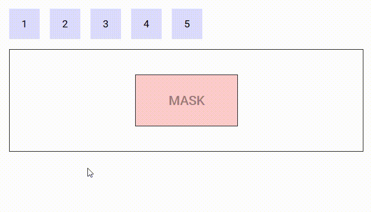
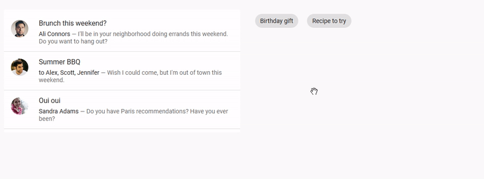
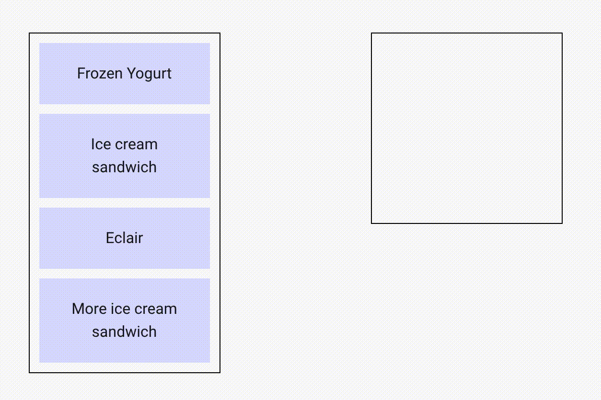

# Vue-Easy-DnD (_A HTML5 Drag-and-Drop Replacement_)
Easy-DnD is a drag and drop implementation for Vue.js 2 that uses only standard mouse events instead of the HTML5 drag and drop API, which is [impossible to work with](https://www.quirksmode.org/blog/archives/2009/09/the_html5_drag.html). Think of it as a way to transfer data from some components to others using the mouse or support for a mouse assisted copy/cut - paste. It also allows for lists to be reordered by drag and drop.

# Installation

Install via [npm](https://npmjs.com) or [yarn](https://yarnpkg.com)

```bash
# Use npm
npm install vue-easy-dnd --save

# Use yarn
yarn add vue-easy-dnd
```

&nbsp;\
&nbsp;\
&nbsp;\
&nbsp;
# FAQ

## Does it support IE 11 ?

Yes with a polyfill for custom events such as https://www.npmjs.com/package/custom-event-polyfill

## Does it support touch devices ?

Yes, including tap `vibration` prop on Drag component.

## Does it support SSR ?

Yes.

## Does it support keyboard events?

Yes. ESC key can be pressed to cancel the drag.

## Does it support Vue 3?

Not at the moment. (This is a community development, so feel free to chip in!)


&nbsp;\
&nbsp;\
&nbsp;\
&nbsp;
# Events

All emit events carry the current state of the drag operation by means of the following properties :

* `type` : the type of the data being transferred
* `data` : the data being transferred
* `position` : the current position of the mouse cursor
* `top` : the foremost Drop component currently under the mouse cursor if any
* `previousTop` : for dragenter and dragleave, the previous value of top if any
* `source` : the Drag component where the drag originated
* `success` : whether the drag completed successfully or not
* `native` : the associated mouse event (or touch event). Can be mousedown/touchstart, mousemove/touchmove or mouseup/touchend.

&nbsp;\
&nbsp;\
&nbsp;\
&nbsp;
# Mixins
## DragAwareMixin

A mixin is available to make components sensitive to drag operations. It adds the following computed to components that incorporate it, reflecting the current state of the drag :

* `dragInProgress` : true if a drag operation is in progress, false otherwise
* `dragType` : the type of the current drag operation
* `dragData` : the data of the current drag operation
* `dragPosition` : the current position of the mouse relative to the document
* `dragSource` : the Drag component from which the drag operation originated
* `dragTop` : the foremost Drop component under the mouse if any

The following demo displays information about the current drag operation when it is in progress :

https://codesandbox.io/s/example-5-j8qo9


&nbsp;\
&nbsp;\
&nbsp;\
&nbsp;
# Components

## Drag
The `drag` component is meant to define an area from which data can be exported. 

### Events
Event Name | Description
---------- | -----------
`@dragstart` | Triggered when a drag operation starts
`@dragend` | Triggered when a drag operation terminates (whether successfully or not)
`@cut` / `@copy` | Triggered when a drag operation completes successfully on a Drop component that requires the data to be removed / copied (event name is dependant on the selected drop `mode` prop)

### Props
Prop Name | Type / Default | Description
--------- | -------------- | -----------
`tag` | Any | This prop can be used to customize the root of the template, Can refer to a custom Vue component, including its props, slots, scoped slots and listeners.
`type` | String (`null`) | Refer to **Types** section below
`data` | Any | Any data associated with this drag which will be sent with the emit event
`drag-image-opacity` | Number (`0.7`) | 0-1 defining the opacity of the drag image
`disabled` | Boolean (`false`) | Whether to temporarily disable dragging this component
`go-back` | Boolean (`false`) | If a drag is not successful, the drag image will animate back to where the drag originated (demo below)
`handle` | String (`undefined`) | A handle / grabber for this Drag component
`delta` | Number (`3`px) | A pixel-distance which defines whether a drag has begun
`delay` | Number (`0`ms) | The number of milliseconds of which the user must hold down the Drag element until it is recognised as a drag (useful for allowing scrolling on Touch devices without it automatically trying to drag the element) (`0` = no delay)
`drag-class` | String (`null`) | A class to bind to the image / ghost being dragged around
`vibration` | Number (`0`ms) | Vibration feedback on supported mobile devices when a Drag event has started (`0` = no feedback)
`scrolling-edge-size` | Number (`100`px) | When dragging this element to the edge of its bounding container/list, the pixel amount defines how close to the edge of the container it will automatically scroll up/down/left/right (`0` = no scrolling on its bounding container)

### Slots
Slot Name | Description
---------- | -----------
`default` | Default content to add at the end of the DropList. Make sure to define a `key` prop for each element directly inside this slot.
`drag-image` | Refer to **Drag Image** section below

### Demo
An example of `go-back` prop

https://codesandbox.io/s/example-1-l6p54



### CSS classes

A Drag component is assigned the class `drag-in` when the mouse is over it and a drag operation isn't in progress, `drag-out` otherwise. Depending on the mode of the Drop component currently under the mouse cursor, the source Drag component is also assigned the classes `drag-mode-copy`, `drag-mode-cut` and `drag-mode-reordering`.

If a drag is in progress, `dnd-ghost` will be bound to the ghost. The Drag component can also optionally accept an additional class (`drag-class` prop) to bind to the ghost. When using a DropList, the `dnd-ghost` class and `drag-class` prop will both **NOT** be bound if the `drag-image` slot is defined.


### Types

A drag operation **may** have a type. The type is a data structure (can be a simple string) that defines the kind of data being transfered. The type of a drag operation is defined by the Drag component that initiates it using the `type` prop.

A Drop component is said to participate in a drag operation if it accepts its type (the default is to accept any type). The type(s) a Drop component accepts can be defined by mean of the `accepts-type` prop (can be a string, an array of strings or a function that takes the type as parameter and returns a boolean).

As far as Easy-DnD is concerned, if a Drop component doesn't accept the type of the current drag operation, it behaves like any other part of the page that is not sensitive to drag and drop. It is ignored during the drag, no special CSS classes are applied, no special cursors / drag images are displayed and no special events are triggered.

The following demo illustrates the use of types. There are two types in use : 'string' and 'number'. The Drag components that contain '1' and '2' are of type 'number', the ones containing 'a' and 'b' are of type 'string'. The two Drop components on the left accept numbers, the ones on the right accept strings. When you drag a number/string (respectively), only Drop components that accept numbers/strings (respectively) react (i.e. drag images, CSS classes, cursors are applied). The other ones are left alone.

https://codesandbox.io/s/example-3-g7io8


### Drag image

During the drag, an image may move along the mouse cursor. Easy-DnD makes it so that this image is always on top of everything else.

Drag components provide the `drag-image` slot that can be used to set the default image displayed during the drag operation :

* if the slot isn't defined, the image is a clone of the Drag component.
* if the slot is defined and empty, there is no image.
* if the slot is not empty, a clone of its content is used.

Drop and DropList components provide the `drag-image` slot (props : `data` and `type`) that can be used to set the image to be displayed when the mouse is over them, if they participates in the current drag operation (i.e. accept its type) :

* if the slot isn't defined, the default image set by the Drag component is used.
* if the slot is defined and empty, there is no image.
* if the slot is not empty, a clone of its content is used.

DropList components additionaly provide the `reordering-drag-image` slot (prop : `item` subject to reordering) that behaves the same way as `drag-image` but controls the drag image to be displayed during list reordering.

The position of the drag image relative to the mouse cursor can be controlled by CSS using the transform property.

The following demo illustrate the use of custom drag images, nested Drop components and a mask :

https://codesandbox.io/s/example-4-6h8zy


&nbsp;\
&nbsp;\
&nbsp;\
&nbsp;
## Drop
The `drop` component is meant to define an area into which data can be imported. Drop components can be nested forming hierarchies of arbitrary depth.

### Events
Event Name | Description
---------- | -----------
`@dragenter` | Triggered when the mouse enters a Drop component
`@dragleave` | Triggered when the mouse leaves a Drop component
`@dragover` | Triggered when the mouse moves over a Drop component
`@drop` | Triggered when a drop operation completes on a Drop component

### Props
Prop Name | Type / Default | Description
--------- | -------------- | -----------
`tag` | Any | This prop can be used to customize the root of the template, Can refer to a custom Vue component, including its props, slots, scoped slots and listeners.
`accepts-type` | String / Array | Refer to **Types** section above
`accepts-data` | Any | Refer to **Restricting droppable data** section below
`drag-image-opacity` | Number (`0.7`) | 0-1 defining the opacity of the drag image when dragging over this drop component
`mode` | String (`copy`) | Refer to **Modes** section below

### CSS classes
During a drag operation, the Drop components on the page are assigned several CSS classes :

* for all Drop components : `type-allowed` if the Drop component accepts the type of the drag operation, `type-forbidden` otherwise
* for the Drop components that participate in the drag operation (i.e. accepts its type) :
  * `drop-in` when the mouse is over one that is foremost at the current mouse position (remember Drop components can be nested), `drop-out` otherwise
  * `drop-allowed` when the Drop component accepts the data and the source of the drag accepts its mode, `drop-forbidden` otherwise


### Modes

A drag and drop can occur in several possible modes, depending on its effect on the origin of the drag :

* `copy` (the default) : if the source of the drag is unaffected by the drag operation,
* `cut` : if the source of the drag is to be removed when the drag operation completes.

Drop components must declare what mode must be triggered when data is dropped into them using the `mode` property.

When a drag operation completes on a Drop component that declares the `cut` (respectively `copy`) mode, a `cut` (respectively `copy`) event is emitted on the Drag component from which the drag operation originated. This gives the opportunity to the surroundings of the Drag component to react to the drop that just happened, for example by removing the data that has been dropped in case of the `cut` event.

If a drag operation originates from a Drag components that doesn't declare a listener for the `cut` event, then dropping is forbidden on a Drop component that declares the `cut` mode.

The following demo illustrates modes in action :

https://codesandbox.io/s/example-2-r8n1k


### Restricting droppable data

Drop components can restrict the data they accept by mean of the `accepts-data` prop (a function that takes the data and type as parameter and returns a boolean).

The following demo defines five Drag components that can be dragged into three Drop components, one that accepts even numbers, one that accepts odd numbers and one that accepts any number but removes them once the drag is complete.

https://codesandbox.io/s/easy-dnd-demo-fo078


&nbsp;\
&nbsp;\
&nbsp;\
&nbsp;
## DropMask
The `drop-mask` component is meant to create an island insensitive to drag and rop on top of a Drop component.

### Props
Prop Name | Type / Default | Description
--------- | -------------- | -----------
`tag` | Any | This prop can be used to customize the root of the template, Can refer to a custom Vue component, including its props, slots, scoped slots and listeners.

### Demo
https://codesandbox.io/s/example-1-gvwsw


&nbsp;\
&nbsp;\
&nbsp;\
&nbsp;
## DropList
The `drop-list` component is a special kind of drop component that displays a list of items that support dragging into and reordering.

### Events
Event Name | Description
---------- | -----------
(Refer to `Drop` component) | DropList components also emit all events by Drop components
`@insert` | Triggered when data is to be inserted into the list (properties : `type`, `data` and `index`). If no listener is provided for this event, the list cannot be inserted into.
`@reorder` | Triggers when data needs to be reordered (properties : `from`, `to` and `apply` - apply is a function that applies the required reordering to the given array). If no listener is provided for this event, the list cannot be reordered.

### Props
Prop Name | Type / Default | Description
--------- | -------------- | -----------
(Refer to `Drop` component) | |DropList components also inherit all props from Drop components
`tag` | Any | This prop can be used to customize the root of the template, just like it can be with drop components, but it can only refer to an HTML element, not a Vue component (this is a restriction of Vue transition-groups - there is nothing I can do about it). However, when the no-animations prop is set to true, this restriction is lifted, and you can use any Vue component.
`items` | Any (Array) | Array of data to use on this DropList
`row` | Boolean (`null`) | Defining the direction of the DropList as horizontally-flowing. (Necessary for Nested DropLists) (Refer to **Nested Droplists** section below)
`column` | Boolean (`null`) | Defining the direction of the DropList as vertically-flowing. (Necessary for Nested DropLists) (Refer to **Nested Droplists** section below)
`no-animations` | Boolean (`false`) | Disable animations on the DropList (necessary if the tag is a custom Vue component)
`scrolling-edge-size` | Number (`undefined`px) | When dragging this element to the edge of this DropList, the pixel amount defines how close to the edge of the DropList it will automatically scroll up/down/left/right (`0` = no scrolling on this DropList). `Undefined` default value means that this DropList will use whatever `scrolling-edge-size` is defined on the Drag component.

### Slots
Slot Name | Description
---------- | -----------
`default` | Default content to add at the end of the DropList. Make sure to define a `key` prop for each element directly inside this slot.
`item` | Used to render each list item. It has three properties, `item` , `index` and `reorder`. Reorder is true when the item is the one subject to reordering. **Don't forget to provide a key for the content of this slot !!**
`feedback` | Used to render a placeholder to show the position where the new item would be inserted if the drag operation ended at the current mouse position. It has two properties : `type` and `data`. **Don't forget to provide a key for the content of this slot !!**
`reordering-drag-image` | Defines the drag image to be used when reordering the list (Refer to  **Drag Image** section above).
`reordering-feedback` | Used to control the feedback used during reordering <br> * If this slot isn't defined, then the items switch positions during reordering to display in real time the order that will be achieved if the drag terminates at the current position <br> * If this slot is defined, then its content is inserted into the list to display the new location of the item being dragged (for an example of this, see nested drop lists)
`empty` | Defined content to display if the list is empty and not being dragged into. Make sure to define a `key` prop for each element directly inside this slot.

### Demo
https://codesandbox.io/s/droplist-ozs8b


### Nested DropLists
Drop lists can be nested providing the following conditions are satisfied :

* the `row` or `column` props must be defined to inform the drop list components of the direction the items are lining up (mandatory)
* for lists that support reordering, the `reordering-feedback` slot must be defined (advisable)
* both the `feedback` and `reordering-feedback` slots must take no space in the layout (for example, `flex: 0 0 0; align-self: strech; outline: 1px solid blue;`) (advisable)

Example :

https://codesandbox.io/s/nested-drop-lists-nw605


&nbsp;\
&nbsp;\
&nbsp;\
&nbsp;

# Advanced Demos

These demos are meant to be pretty and reflect real life examples.

The following demo features list reordering, drag and drop between two lists, custom drag images and custom feedback when inserting new items. It uses Vuetify components.

https://codesandbox.io/s/easy-dnd-demo-9mbij



The following demo features drag and drop between a table and a list, custom drag images and a custom style for drop areas when the drop is allowed. It uses Vuetify components.

https://codesandbox.io/s/easy-dnd-demo-2-xnqbz


The following demo features nested drop lists and a custom drag image. It is a tool to design dashboards by WYSIWYG. New widgets can be dragged into the dashboard from the palette on the left and widgets can be moved around by drag and drop.




