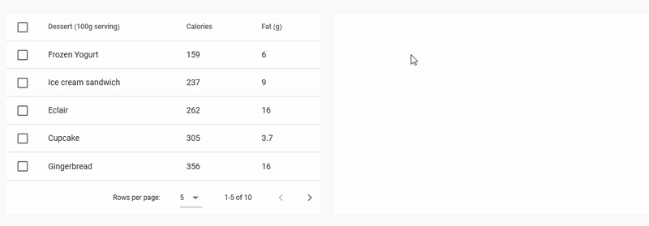

# Advanced Demos

These demos are meant to be pretty and reflect real life examples.

The following demo features list reordering, drag and drop between two lists, custom drag images and custom feedback when inserting new items.

https://codesandbox.io/s/easy-dnd-demo-9mbij

The following demo features drag and drop between a table and a list, custom drag images and a custom style for drop areas when the drop is allowed.

https://codesandbox.io/s/easy-dnd-demo-2-xnqbz

The following demo features nested drop lists and a custom drag image. It is a tool to design dashboards by WYSIWYG. New widgets can be dragged into the dashboard from the palette on the left and widgets can be moved around by drag and drop.

