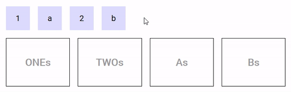
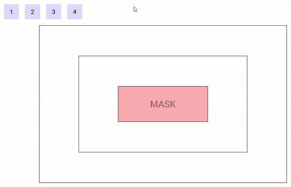

# Drag
The `drag` component is meant to define an area from which data can be exported.

## Events
Event Name | Description
---------- | -----------
`@dragstart` | Triggered when a drag operation starts
`@dragend` | Triggered when a drag operation terminates (whether successfully or not)
`@cut` / `@copy` | Triggered when a drag operation completes successfully on a Drop component that requires the data to be removed / copied (event name is dependant on the selected drop `mode` prop)

## Props
Prop Name | Type / Default | Description
--------- | -------------- | -----------
`tag` | Any | This prop can be used to customize the root of the template, Can refer to a custom Vue component, including its props, slots and listeners.
`type` | String (`null`) | Refer to **Types** section below
`data` | Any | Any data associated with this drag which will be sent with the emit event
`drag-image-opacity` | Number (`0.7`) | 0-1 defining the opacity of the drag image
`disabled` | Boolean (`false`) | Whether to temporarily disable dragging this component
`go-back` | Boolean (`false`) | If a drag is not successful, the drag image will animate back to where the drag originated (demo below)
`handle` | String (`undefined`) | A handle / grabber for this Drag component
`delta` | Number (`3`px) | A pixel-distance which defines whether a drag has begun
`delay` | Number (`0`ms) | The number of milliseconds of which the user must hold down the Drag element until it is recognised as a drag (useful for allowing scrolling on Touch devices without it automatically trying to drag the element) (`0` = no delay)
`drag-class` | String (`null`) | A class to bind to the image / ghost being dragged around
`vibration` | Number (`0`ms) | Vibration feedback on supported mobile devices when a Drag event has started (`0` = no feedback)
`scrolling-edge-size` | Number (`100`px) | When dragging this element to the edge of its bounding container/list, the pixel amount defines how close to the edge of the container it will automatically scroll up/down/left/right (`0` = no scrolling on its bounding container)

## Slots
Slot Name | Description
---------- | -----------
`default` | Default content to add at the end of the DropList. Make sure to define a `key` prop for each element directly inside this slot.
`drag-image` | Refer to **Drag Image** section below

## Demo
An example of `go-back` prop

https://codesandbox.io/s/example-1-l6p54

## CSS classes

Depending on the mode of the Drop component currently under the mouse cursor, the source Drag component is assigned the classes `drag-mode-copy`, `drag-mode-cut` and `drag-mode-reordering`.

If a drag is in progress, `dnd-ghost` will be bound to the ghost. The Drag component can also optionally accept an additional class (`drag-class` prop) to bind to the ghost. When using a DropList, the `dnd-ghost` class and `drag-class` prop will both **NOT** be bound if the `drag-image` slot is defined.

To prevent dragging your Draggable component from a child element, you may attach the class `dnd-no-drag` to the child. That way the entire element remains draggable, whereas specific sub-children can have dragging from themselves disabled.

## Types

A drag operation **may** have a type. The type is a data structure (can be a simple string) that defines the kind of data being transfered. The type of a drag operation is defined by the Drag component that initiates it using the `type` prop.

A Drop component is said to participate in a drag operation if it accepts its type (the default is to accept any type). The type(s) a Drop component accepts can be defined by mean of the `accepts-type` prop (can be a string, an array of strings or a function that takes the type as parameter and returns a boolean).

The following demo illustrates the use of types. There are two types in use : 'string' and 'number'. The Drag components that contain '1' and '2' are of type 'number', the ones containing 'a' and 'b' are of type 'string'. The two Drop components on the left accept numbers, the ones on the right accept strings. When you drag a number/string (respectively), only Drop components that accept numbers/strings (respectively) react (i.e. drag images, CSS classes, cursors are applied). The other ones are left alone.

https://codesandbox.io/s/example-3-g7io8

## Drag image

During the drag, an image may move along the mouse cursor. Easy-DnD makes it so that this image is always on top of everything else.

Drag components provide the `drag-image` slot that can be used to set the default image displayed during the drag operation :

* if the slot isn't defined, the image is a clone of the Drag component.
* if the slot is defined and empty, there is no image.
* if the slot is not empty, a clone of its content is used.

Drop and DropList components provide the `drag-image` slot (props : `data` and `type`) that can be used to set the image to be displayed when the mouse is over them, if they participates in the current drag operation (i.e. accept its type) :

* if the slot isn't defined, the default image set by the Drag component is used.
* if the slot is defined and empty, there is no image.
* if the slot is not empty, a clone of its content is used.

DropList components additionaly provide the `reordering-drag-image` slot (prop : `item` subject to reordering) that behaves the same way as `drag-image` but controls the drag image to be displayed during list reordering.

The position of the drag image relative to the mouse cursor can be controlled by CSS using the transform property.

The following demo illustrate the use of custom drag images, nested Drop components and a mask :

https://codesandbox.io/s/example-4-6h8zy

