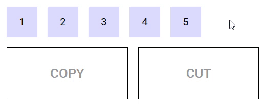
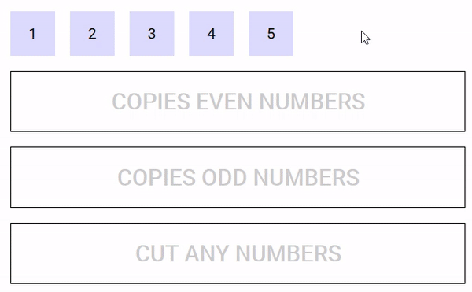

# Drop
The `drop` component is meant to define an area into which data can be imported. Drop components can be nested forming hierarchies of arbitrary depth.

## Events
Event Name | Description
---------- | -----------
`@dragenter` | Triggered when the mouse enters a Drop component
`@dragleave` | Triggered when the mouse leaves a Drop component
`@dragover` | Triggered when the mouse moves over a Drop component
`@dragend` | Triggered when a drag event is finished while a Drag element is hovered over this Drop component. (Including if ESC is pressed while a Drag element was over the top of this Drop component)
`@drop` | Triggered when a drop operation completes on a Drop component

## Props
Prop Name | Type / Default | Description
--------- | -------------- | -----------
`tag` | Any | This prop can be used to customize the root of the template, Can refer to a custom Vue component, including its props, slots and listeners.
`accepts-type` | String / Array | Refer to **Types** section above
`accepts-data` | Any | Refer to **Restricting droppable data** section below
`drag-image-opacity` | Number (`0.7`) | 0-1 defining the opacity of the drag image when dragging over this drop component
`mode` | String (`copy`) | Refer to **Modes** section below

## CSS classes
During a drag operation, the Drop components on the page are assigned several CSS classes :

* for all Drop components : `type-allowed` if the Drop component accepts the type of the drag operation, `type-forbidden` otherwise
* for the Drop components that participate in the drag operation (i.e. accepts its type) :
  * `drop-in` when the mouse is over one that is foremost at the current mouse position (remember Drop components can be nested), `drop-out` otherwise
  * `drop-allowed` when the Drop component accepts the data and the source of the drag accepts its mode, `drop-forbidden` otherwise

## Modes

A drag and drop can occur in several possible modes, depending on its effect on the origin of the drag :

* `copy` (the default) : if the source of the drag is unaffected by the drag operation,
* `cut` : if the source of the drag is to be removed when the drag operation completes.

Drop components must declare what mode must be triggered when data is dropped into them using the `mode` property.

When a drag operation completes on a Drop component that declares the `cut` (respectively `copy`) mode, a `cut` (respectively `copy`) event is emitted on the Drag component from which the drag operation originated. This gives the opportunity to the surroundings of the Drag component to react to the drop that just happened, for example by removing the data that has been dropped in case of the `cut` event.

If a drag operation originates from a Drag components that doesn't declare a listener for the `cut` event, then dropping is forbidden on a Drop component that declares the `cut` mode.

The following demo illustrates modes in action :

https://codesandbox.io/s/example-2-r8n1k

## Restricting droppable data

Drop components can restrict the data they accept by mean of the `accepts-data` prop (a function that takes the data and type as parameter and returns a boolean).

The following demo defines five Drag components that can be dragged into three Drop components, one that accepts even numbers, one that accepts odd numbers and one that accepts any number but removes them once the drag is complete.

https://codesandbox.io/s/easy-dnd-demo-fo078

