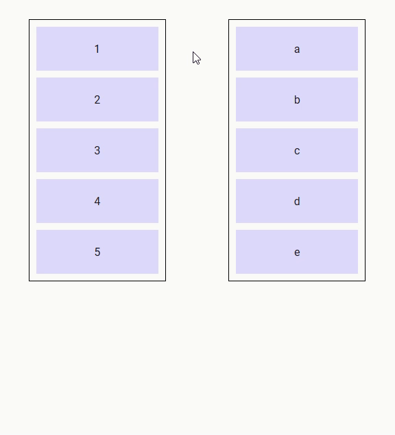
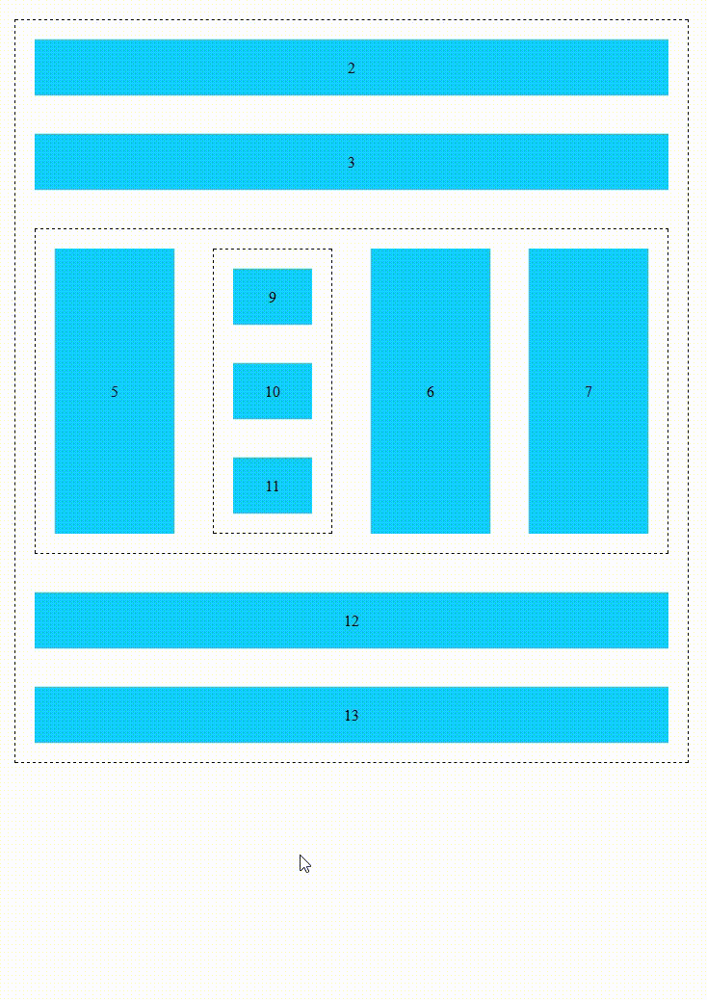

# DropList
The `drop-list` component is a special kind of drop component that displays a list of items that support dragging into and reordering.

## Events
Event Name | Description
---------- | -----------
(Refer to `Drop` component) | DropList components also emit all events by Drop components
`@insert` | Triggered when data is to be inserted into the list (properties : `type`, `data` and `index`). If no listener is provided for this event, the list cannot be inserted into.
`@reorder` | Triggers when data needs to be reordered (properties : `from`, `to` and `apply` - apply is a function that applies the required reordering to the given array). If no listener is provided for this event, the list cannot be reordered.

## Props
Prop Name | Type / Default | Description
--------- | -------------- | -----------
(Refer to `Drop` component) | |DropList components also inherit all props from Drop components
`tag` | Any | This prop can be used to customize the root of the template, just like it can be with drop components, but it can only refer to an HTML element, not a Vue component (this is a restriction of Vue transition-groups - there is nothing I can do about it). However, when the no-animations prop is set to true, this restriction is lifted, and you can use any Vue component.
`items` | Any (Array) | Array of data to use on this DropList
`row` | Boolean (`null`) | Defining the direction of the DropList as horizontally-flowing. (Necessary for Nested DropLists) (Refer to **Nested Droplists** section below)
`column` | Boolean (`null`) | Defining the direction of the DropList as vertically-flowing. (Necessary for Nested DropLists) (Refer to **Nested Droplists** section below)
`no-animations` | Boolean (`false`) | Disable animations on the DropList (necessary if the tag is a custom Vue component)
`scrolling-edge-size` | Number (`undefined`px) | When dragging a Drag component to the edge of this DropList, the pixel amount defines how close to the edge of the DropList a scroll will be triggered up/down/left/right (`0` = no scrolling on this DropList). `Undefined` default value means that this DropList will use whatever `scrolling-edge-size` is defined on the Drag component.

## Slots
Slot Name | Description
---------- | -----------
`default` | Default content to add at the end of the DropList. Make sure to define a `key` prop for each element directly inside this slot.
`item` | Used to render each list item. It has three properties, `item` , `index` and `reorder`. Reorder is true when the item is the one subject to reordering. **Don't forget to provide a key for the content of this slot !!**
`feedback` | Used to render a placeholder to show the position where the new item would be inserted if the drag operation ended at the current mouse position. It has two properties : `type` and `data`. **Don't forget to provide a key for the content of this slot !!**
`reordering-drag-image` | Defines the drag image to be used when reordering the list (Refer to  **Drag Image** section above).
`reordering-feedback` | Used to control the feedback used during reordering   * If this slot isn't defined, then the items switch positions during reordering to display in real time the order that will be achieved if the drag terminates at the current position   * If this slot is defined, then its content is inserted into the list to display the new location of the item being dragged (for an example of this, see nested drop lists)
`empty` | Defined content to display if the list is empty and not being dragged into. Make sure to define a `key` prop for each element directly inside this slot.

## Demo
https://codesandbox.io/s/droplist-ozs8b

## Nested DropLists
Drop lists can be nested providing the following conditions are satisfied :

* the `row` or `column` props must be defined to inform the drop list components of the direction the items are lining up (mandatory)
* for lists that support reordering, the `reordering-feedback` slot must be defined (advisable)
* both the `feedback` and `reordering-feedback` slots must take no space in the layout (for example, `flex: 0 0 0; align-self: strech; outline: 1px solid blue;`) (advisable)

Example :

https://codesandbox.io/s/nested-drop-lists-nw605

