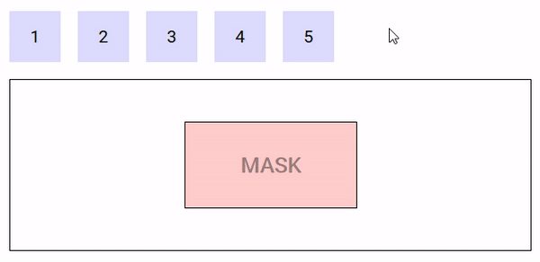

# DropMask
The `drop-mask` component is meant to create an island insensitive to drag and rop on top of a Drop component.

## Props
Prop Name | Type / Default | Description
--------- | -------------- | -----------
`tag` | Any | This prop can be used to customize the root of the template, Can refer to a custom Vue component, including its props, slots and listeners.

## Demo
https://codesandbox.io/s/example-1-gvwsw

