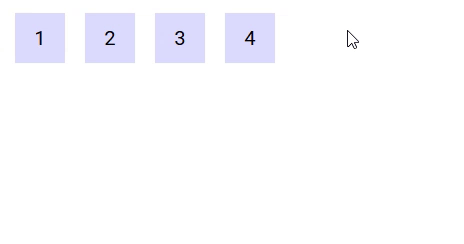

# Events

## Structure
All emit events carry the current state of the drag operation by means of the following properties :

* `type` : the type of the data being transferred
* `data` : the data being transferred
* `position` : the current position of the mouse cursor
* `top` : the foremost Drop component currently under the mouse cursor if any
* `previousTop` : for dragenter and dragleave, the previous value of top if any
* `source` : the Drag component where the drag originated
* `success` : whether the drag completed successfully or not
* `native` : the associated mouse event (or touch event). Can be mousedown/touchstart, mousemove/touchmove or mouseup/touchend.

&nbsp;\
&nbsp;
# Mixins
## DragAwareMixin

A mixin is available to make components sensitive to drag operations. It adds the following computed to components that incorporate it, reflecting the current state of the drag :

* `dragInProgress` : true if a drag operation is in progress, false otherwise
* `dragType` : the type of the current drag operation
* `dragData` : the data of the current drag operation
* `dragPosition` : the current position of the mouse relative to the document
* `dragSource` : the Drag component from which the drag operation originated
* `dragTop` : the foremost Drop component under the mouse if any

The following demo displays information about the current drag operation when it is in progress :

https://codesandbox.io/s/example-5-j8qo9

